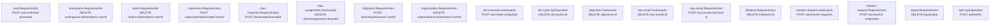

# RBAC Call Graph
Generated: 2025-11-05T19:57:17.326Z

```mermaid
graph TD
  user_RequireAction["user.RequireAction<br/>POST users"]
  user_RequireAction["user.RequireAction<br/>PATCH users:id"]
  user_RequireAction["user.RequireAction<br/>POST users:id/reset-password"]
  workspace_RequireAction["workspace.RequireAction<br/>POST workspaces"]
  workspace_RequireAction["workspace.RequireAction<br/>PATCH workspaces:id"]
  workspace_RequireAction["workspace.RequireAction<br/>DELETE workspaces:id"]
  workspace_RequireAction["workspace.RequireAction<br/>POST workspaces:id/members"]
  workspace_RequireAction["workspace.RequireAction<br/>DELETE workspaces:id/members/:userId"]
  team_RequireAction["team.RequireAction<br/>POST teams"]
  team_RequireAction["team.RequireAction<br/>PATCH teams:id"]
  team_RequireAction["team.RequireAction<br/>DELETE teams:id"]
  team_RequireAction["team.RequireAction<br/>POST teams:id/members"]
  team_RequireAction["team.RequireAction<br/>DELETE teams:id/members/:userId"]
  superuser_RequireAction["superuser.RequireAction<br/>POST superusercreate"]
  superuser_RequireAction["superuser.RequireAction<br/>POST superuserpromote/:userId"]
  superuser_RequireAction["superuser.RequireAction<br/>POST superuserrevoke/:userId"]
  superuser_RequireAction["superuser.RequireAction<br/>POST superuserorganizations"]
  superuser_RequireAction["superuser.RequireAction<br/>POST superuserorganizations/:organizationId/users/:userId"]
  superuser_RequireAction["superuser.RequireAction<br/>DELETE superuserorganizations/:organizationId/users/:userId"]
  superuser_RequireAction["superuser.RequireAction<br/>POST superuserimpersonate/:userId"]
  rbac-inspector_RequireAction["rbac-inspector.RequireAction<br/>POST rbac/inspectorenable"]
  rbac-assignment_UseGuards["rbac-assignment.UseGuards<br/>POST rbac/assignmentsassign"]
  rbac-assignment_UseGuards["rbac-assignment.UseGuards<br/>DELETE rbac/assignments:assignmentId"]
  rbac-assignment_UseGuards["rbac-assignment.UseGuards<br/>POST rbac/assignments:tenantId/add"]
  rbac-assignment_UseGuards["rbac-assignment.UseGuards<br/>POST rbac/assignments:tenantId/remove"]
  rbac-assignment_UseGuards["rbac-assignment.UseGuards<br/>POST rbac/assignments:tenantId/set"]
  rbac-assignment_UseGuards["rbac-assignment.UseGuards<br/>DELETE rbac/assignments:tenantId"]
  migration_RequireAction["migration.RequireAction<br/>POST rbac/migrationall"]
  migration_RequireAction["migration.RequireAction<br/>POST rbac/migrationuser/:userId"]
  organization_RequireAction["organization.RequireAction<br/>POST organizations"]
  organization_RequireAction["organization.RequireAction<br/>PATCH organizations:id"]
  organization_RequireAction["organization.RequireAction<br/>DELETE organizations:id"]
  organization_RequireAction["organization.RequireAction<br/>POST organizations:id/members"]
  organization_RequireAction["organization.RequireAction<br/>DELETE organizations:id/members/:userId"]
  okr-overview_UseGuards["okr-overview.UseGuards<br/>POST okrcreate-composite"]
  okr-cycle_ApiOperation["okr-cycle.ApiOperation<br/>POST okr/cycles"]
  okr-cycle_ApiOperation["okr-cycle.ApiOperation<br/>PATCH okr/cycles:id"]
  okr-cycle_ApiOperation["okr-cycle.ApiOperation<br/>PATCH okr/cycles:id/status"]
  okr-cycle_ApiOperation["okr-cycle.ApiOperation<br/>DELETE okr/cycles:id"]
  objective_UseGuards["objective.UseGuards<br/>POST objectives"]
  objective_UseGuards["objective.UseGuards<br/>PATCH objectives:id"]
  objective_UseGuards["objective.UseGuards<br/>DELETE objectives:id"]
  key-result_UseGuards["key-result.UseGuards<br/>POST key-results"]
  key-result_UseGuards["key-result.UseGuards<br/>PATCH key-results:id"]
  key-result_UseGuards["key-result.UseGuards<br/>DELETE key-results:id"]
  key-result_RequireAction["key-result.RequireAction<br/>POST key-results:id/check-in"]
  initiative_RequireAction["initiative.RequireAction<br/>POST initiatives"]
  initiative_RequireAction["initiative.RequireAction<br/>PATCH initiatives:id"]
  initiative_RequireAction["initiative.RequireAction<br/>DELETE initiatives:id"]
  checkin-request_UseGuards["checkin-request.UseGuards<br/>POST okrcheckin-requests"]
  checkin-request_RequireAction["checkin-request.RequireAction<br/>POST okrcheckin-responses"]
  layout_RequireAction["layout.RequireAction<br/>POST layoutsave"]
  layout_RequireAction["layout.RequireAction<br/>DELETE layout:entityType/:entityId"]
  layout_RequireAction["layout.RequireAction<br/>DELETE layoutclear"]
  auth_ApiOperation["auth.ApiOperation<br/>POST authregister"]
  auth_ApiOperation["auth.ApiOperation<br/>POST authlogin"]
  auth_ApiOperation["auth.ApiOperation<br/>POST authverify"]
```
